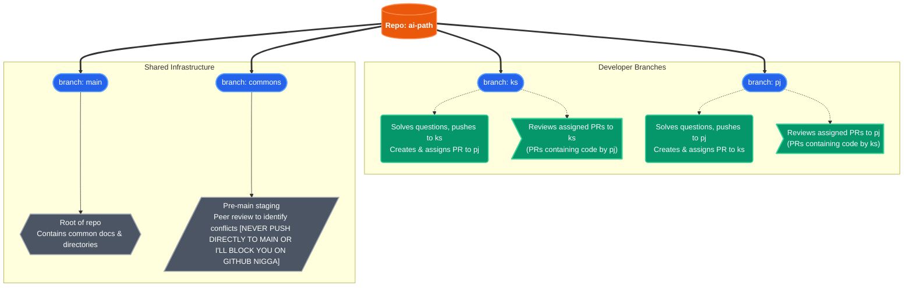

```mermaid
flowchart TD
    A[("Repo: ai-path")]

    subgraph Devs [Developer Branches]
        b(["branch: ks"])
        f("Solves questions, pushes to ks<br/>Creates & assigns PR to pj")
        g>"Reviews assigned PRs to ks<br/>(PRs containing code by pj)"]
        
        c(["branch: pj"])
        e("Solves questions, pushes to pj<br/>Creates & assigns PR to ks")
        d>"Reviews assigned PRs to pj<br/>(PRs containing code by ks)"]
    end

    subgraph Shared [Shared Infrastructure]
        h(["branch: main"])
        i{{"Root of repo<br/>Contains common docs & directories"}}
        
        j(["branch: commons"])
        k[/"Pre-main staging<br/>Peer review to identify conflicts [NEVER PUSH DIRECTLY TO MAIN OR I'LL BLOCK YOU ON GITHUB NIGGA]"/]
    end

    A ==> b
    A ==> c
    A ==> h
    A ==> j

    b -.-> f
    b -.-> g
    
    c -.-> e
    c -.-> d

    h ---> i
    j ---> k

    classDef repo fill:#ea580c,stroke:#ff8a4c,stroke-width:2px,color:#ffffff,font-weight:bold
    classDef branch fill:#2563eb,stroke:#60a5fa,stroke-width:2px,color:#ffffff
    classDef action fill:#059669,stroke:#34d399,stroke-width:2px,color:#ffffff
    classDef info fill:#4b5563,stroke:#9ca3af,stroke-width:2px,color:#ffffff

    class A repo
    class b,c,h,j branch
    class e,f,d,g action
    class i,k info
```    