```mermaid
flowchart TD

    START(["AI ENGINEER ROADMAP<br/>Complete Free Resource Map"])

    START --> PY["PHASE 1 — PYTHON"]

    subgraph PYTHON["Python Foundations + Engineering"]
        PY1["CS50P — Harvard Intro to Programming with Python<br/>35h"]
        PY2["Python Official Tutorial<br/>8h"]
        PY3["Corey Schafer — Python OOP & Generators<br/>8h"]
        PY4["Real Python — Generators / Iterators<br/>3h"]
        PY5["Real Python — Async IO in Python<br/>3h"]
        PY6["Python Docs — asyncio<br/>2h"]
        PY7["Python Docs — venv<br/>1h"]
        PY8["Corey Schafer — venv<br/>1h"]
        PY9["pip Documentation<br/>1h"]
        PY10["Automate the Boring Stuff with Python<br/>15h"]
        PY11["Python Official Library Docs<br/>3h"]
        PY12["Real Python — Regex Guide<br/>3h"]
        PY13["Real Python — Threading<br/>3h"]
        PY14["Python Docs — threading<br/>1h"]
        PY15["Python Docs — sqlite3<br/>3h"]
        PY16["Corey Schafer — SQLite<br/>3h"]
        PY17["Python Docs — json<br/>1h"]
        PY18["Real Python — Python requests<br/>3h"]
        PY19["Real Python — Testing in Python<br/>3h"]
        PY20["Python Docs — unittest<br/>1h"]
        PY21["NumPy Official Quickstart<br/>3h"]
        PY22["Keith Galli — NumPy<br/>3h"]
        PY23["Pandas — 10 Minutes to pandas<br/>2h"]
        PY24["Data School — Pandas<br/>8h"]
        PY25["Corey Schafer — Pandas<br/>5h"]
        PY26["Official Jupyter Docs<br/>2h"]
        PY27["Corey Schafer — Jupyter<br/>2h"]
        PY28["Matplotlib Official Tutorials<br/>4h"]
        PY29["Seaborn Official Tutorial<br/>2h"]
        PY30["Corey Schafer — Matplotlib<br/>4h"]
        PY31["scikit-learn Official Tutorials<br/>8h"]
        PY32["freeCodeCamp — scikit-learn<br/>6h"]
    end

    PY --> PY1
    PY1 -.-> PY2
    PY1 --> PY3
    PY3 -.-> PY4
    PY3 --> PY5
    PY5 -.-> PY6
    PY1 --> PY7
    PY7 --> PY8
    PY7 --> PY9
    PY1 --> PY10
    PY1 --> PY11
    PY1 --> PY12
    PY1 --> PY13
    PY13 -.-> PY14
    PY1 --> PY15
    PY15 -.-> PY16
    PY1 --> PY17
    PY1 --> PY18
    PY1 --> PY19
    PY19 -.-> PY20
    PY1 --> PY21
    PY21 -.-> PY22
    PY1 --> PY23
    PY23 --> PY24
    PY23 -.-> PY25
    PY1 --> PY26
    PY26 -.-> PY27
    PY1 --> PY28
    PY28 --> PY29
    PY28 -.-> PY30
    PY1 --> PY31
    PY31 -.-> PY32

    PY10 --> PYPROJECT["PYTHON PROJECT<br/>CLI → CSV → Pandas Cleaning → SQLite → FastAPI/Flask → pytest<br/>8h"]

    PYPROJECT --> CLASSICAL

    CLASSICAL["PHASE 2 — CLASSICAL / SYMBOLIC AI"]

    subgraph AI["Classical / Symbolic AI"]
        AI1["CS50's Introduction to AI with Python<br/>25h"]
        AI2["Berkeley CS188 — Intro to AI<br/>25h"]
        AI3["MIT 6.034 Artificial Intelligence — Patrick Winston<br/>20h"]
        AI4["GeeksforGeeks — AO* Search<br/>1h"]
        AI5["GeeksforGeeks — Water Jug<br/>1h"]
        AI6["GeeksforGeeks — Monkey & Banana<br/>1h"]
        AI7["GeeksforGeeks — Block Words<br/>1h"]
    end

    CLASSICAL --> AI1
    AI1 --> AI2
    AI1 --> AI3
    AI2 --> AI3
    AI3 --> AI4
    AI2 --> AI5
    AI2 --> AI6
    AI2 --> AI7

    AI5 --> AIPROJECT["CLASSICAL AI PROJECT<br/>Water Jug + Monkey & Banana<br/>BFS → A* from scratch<br/>8h"]

    AIPROJECT --> ML

    ML["PHASE 3 — MACHINE LEARNING"]

    subgraph MACHINELEARNING["Classical ML + Theory"]
        ML1["Andrew Ng — Machine Learning Specialization<br/>45h"]
        ML2["StatQuest with Josh Starmer<br/>15h"]
        ML3["GeeksforGeeks — Apriori / Association Rule Mining<br/>2h"]
        ML4["GeeksforGeeks — Curse of Dimensionality<br/>1h"]
        ML5["GeeksforGeeks — Semi-Supervised Learning<br/>1h"]
        ML6["David Silver — Reinforcement Learning Course<br/>15h"]
        ML7["Hugging Face — Deep RL Course<br/>10h"]
        ML8["Probabilistic Graphical Models Specialization — Daphne Koller<br/>30h"]
        ML9["Stanford CS228 Lecture Notes<br/>15h"]
        ML10["StatQuest — Classical ML Metrics<br/>4h"]
    end

    ML --> ML1
    ML1 --> ML2
    ML2 --> ML3
    ML2 --> ML4
    ML1 --> ML5
    ML1 --> ML6
    ML6 -.-> ML7
    ML1 --> ML8
    ML8 -.-> ML9
    ML2 --> ML10

    ML1 --> MLPROJECT["ML PROJECT<br/>Decision Tree + Naive Bayes + K-Means + PCA<br/>Confusion Matrix + F1 + ROC-AUC<br/>10h"]

    MLPROJECT --> DL

    DL["PHASE 4 — DEEP LEARNING"]

    subgraph DEEPLEARNING["Deep Learning"]
        DL1["3Blue1Brown — Neural Networks<br/>5h"]
        DL2["Andrej Karpathy — Neural Networks: Zero to Hero<br/>25h"]
        DL3["Stanford CS231n — CNNs<br/>25h"]
        DL4["Stanford CS224n — NLP with Deep Learning<br/>25h"]
        DL5["Karpathy — Let's Build GPT from Scratch<br/>12h"]
        DL6["MIT 6.S191 — Introduction to Deep Learning<br/>12h"]
        DL7["Deep Learning Specialization — Andrew Ng<br/>40h"]
        DL8["fast.ai — Practical Deep Learning for Coders<br/>20h"]
    end

    DL --> DL1
    DL1 --> DL2
    DL2 --> DL3
    DL2 --> DL4
    DL2 --> DL5
    DL3 --> DL6
    DL4 --> DL6
    DL1 --> DL7
    DL7 --> DL8

    DL3 --> DLPROJECT["DL PROJECT<br/>CNN on CIFAR-10/MNIST from scratch<br/>→ Fine-tune pretrained model<br/>→ Compare<br/>12h"]

    DLPROJECT --> CVNLP

    CVNLP["PHASE 5 — COMPUTER VISION + NLP"]

    subgraph VISIONLANG["Computer Vision"]
        CV1["Stanford CS231n<br/>25h"]
        CV2["Hugging Face Computer Vision Course<br/>15h"]
        CV3["PyImageSearch — OCR Tutorials<br/>5h"]
        CV4["Tesseract<br/>2h"]
        CV5["EasyOCR<br/>2h"]
    end

    subgraph NLP["Natural Language Processing"]
        NLP1["Stanford CS224n<br/>25h"]
        NLP2["Hugging Face NLP Course<br/>20h"]
        NLP3["spaCy Course<br/>8h"]
    end

    CVNLP --> CV1
    CV1 --> CV2
    CV2 --> CV3
    CV3 --> CV4
    CV3 --> CV5

    CVNLP --> NLP1
    NLP1 --> NLP2
    NLP2 --> NLP3

    CV2 --> CVNLPPROJECT["CV/NLP PROJECT<br/>Fine-tune DistilBERT for text classification<br/>+ OCR scanned image<br/>+ classify extracted text<br/>12h"]

    NLP2 --> CVNLPPROJECT

    CVNLPPROJECT --> GENAI

    GENAI["PHASE 6 — GENERATIVE AI"]

    subgraph GENERATIVE["Generative AI"]
        GEN1["Karpathy — Let's Build GPT from Scratch<br/>12h"]
        GEN2["Google — Generative AI Learning Path<br/>10h"]
        GEN3["Hugging Face — Diffusion Models Course<br/>10h"]
        GEN4["DeepLearning.AI — Fine-Tuning / Efficient Fine-Tuning Short Courses<br/>6h"]
        GEN5["Microsoft — Generative AI for Beginners<br/>15h"]
    end

    GENAI --> GEN1
    GEN1 --> GEN2
    GEN1 --> GEN3
    GEN2 --> GEN4
    GEN4 --> GEN5

    GEN1 --> GENPROJECT["GEN AI PROJECT<br/>Temperature + Top-p text generation<br/>+ Local diffusion model<br/>+ Observe denoising<br/>8h"]

    GENPROJECT --> LLM

    LLM["PHASE 7 — LLM ENGINEERING"]

    subgraph LLMENG["LLM Engineering"]
        LLM1["DeepLearning.AI / OpenAI — ChatGPT Prompt Engineering for Developers<br/>2h"]
        LLM2["Anthropic — Prompt Engineering Interactive Tutorial<br/>4h"]
        LLM3["DeepLearning.AI — Building Systems with the ChatGPT API<br/>2h"]
        LLM4["DeepLearning.AI — Functions, Tools and Agents with LangChain<br/>3h"]
        LLM5["Anthropic Academy<br/>8h"]
        LLM6["Hugging Face — Open LLM Leaderboard<br/>1h"]
        LLM7["Ollama Documentation<br/>2h"]
        LLM8["Anthropic — Tool Use Documentation<br/>3h"]
    end

    LLM --> LLM1
    LLM1 --> LLM2
    LLM2 --> LLM3
    LLM3 --> LLM4
    LLM4 --> LLM8
    LLM1 --> LLM5
    LLM5 --> LLM6
    LLM6 --> LLM7

    LLM4 --> LLMPROJECT["LLM PROJECT<br/>Same task × 3 prompts<br/>Naive → Few-shot → Structured<br/>Compare real API outputs<br/>4h"]

    LLMPROJECT --> EMB

    EMB["PHASE 8 — EMBEDDINGS"]

    subgraph EMBEDDINGS["Embeddings + Vector Search"]
        EMB1["DeepLearning.AI — Vector Databases: from Embeddings to Applications<br/>1.5h"]
        EMB2["DeepLearning.AI — Building Applications with Vector Databases<br/>2h"]
        EMB3["Pinecone Learn<br/>4h"]
        EMB4["Chroma<br/>2h"]
    end

    EMB --> EMB1
    EMB1 --> EMB2
    EMB2 --> EMB3
    EMB3 --> EMB4

    EMB4 --> EMBPROJECT["EMBEDDINGS PROJECT<br/>100 documents → embeddings → Chroma<br/>Raw cosine similarity / vector math<br/>→ Top-5 nearest neighbors<br/>6h"]

    EMBPROJECT --> RAG

    RAG["PHASE 9 — RAG"]

    subgraph RAGENG["Retrieval-Augmented Generation"]
        RAG1["DeepLearning.AI — Chat with Your Data<br/>2h"]
        RAG2["DeepLearning.AI — Building Agentic RAG with LlamaIndex<br/>2h"]
        RAG3["Pinecone Learn — RAG<br/>4h"]
        RAG4["DeepLearning.AI — Building and Evaluating Advanced RAG<br/>3h"]
        RAG5["LangChain<br/>3h"]
        RAG6["LlamaIndex<br/>3h"]
    end

    RAG --> RAG1
    RAG1 --> RAG2
    RAG2 --> RAG3
    RAG3 --> RAG4
    RAG1 --> RAG5
    RAG2 --> RAG6

    RAG4 --> RAGPROJECT["RAG PROJECT<br/>PDF ingestion → parsing → chunking<br/>→ embedding → retrieval → generation<br/>→ citations<br/>→ test hallucination refusal<br/>12h"]

    RAGPROJECT --> TOOLS

    TOOLS["PHASE 10 — TOOL CALLING + MCP"]

    subgraph MCP["Tool Calling & Model Context Protocol"]
        TOOL1["DeepLearning.AI — Functions, Tools and Agents with LangChain<br/>3h"]
        TOOL2["Anthropic — Tool Use Documentation<br/>3h"]
        TOOL3["DeepLearning.AI — MCP: Build Rich-Context AI Apps with Anthropic<br/>2h"]
        TOOL4["Anthropic Academy — Introduction to MCP<br/>3h"]
        TOOL5["Anthropic Academy — MCP Advanced Topics<br/>4h"]
        TOOL6["Hugging Face — MCP Course<br/>8h"]
        TOOL7["Model Context Protocol — Official Specification<br/>3h"]
    end

    TOOLS --> TOOL1
    TOOL1 --> TOOL2
    TOOL2 --> TOOL3
    TOOL3 --> TOOL4
    TOOL4 --> TOOL5
    TOOL5 --> TOOL6
    TOOL6 --> TOOL7

    TOOL7 --> MCPPROJECT["MCP PROJECT<br/>Custom MCP Server<br/>→ Local DB tool<br/>→ Connect to Claude<br/>→ Schemas + transport + permissions<br/>8h"]

    MCPPROJECT --> AGENTS

    AGENTS["PHASE 11 — AI AGENTS"]

    subgraph AGENTENG["AI Agents"]
        AG1["Hugging Face — Agents Course<br/>25h"]
        AG2["DeepLearning.AI — AI Agentic Design Patterns<br/>4h"]
        AG3["LangChain Academy — LangGraph<br/>8h"]
        AG4["Anthropic — Building Effective Agents<br/>2h"]
        AG5["Anthropic — Computer Use Documentation<br/>3h"]
    end

    AGENTS --> AG1
    AG1 --> AG2
    AG2 --> AG3
    AG3 --> AG4
    AG4 --> AG5

    AG5 --> AGPROJECT["AGENT PROJECT<br/>Agent with 2–3 real tools<br/>Web search + calculator + file reader<br/>→ tool selection → multi-step execution<br/>→ deliberately break it → study failure modes<br/>10h"]

    AGPROJECT --> MULTI

    MULTI["PHASE 12 — MULTIMODAL AI"]

    subgraph MULTIMODAL["Multimodal AI"]
        MM1["DeepLearning.AI / Intel — Multimodal RAG: Chat with Videos<br/>2h"]
        MM2["DeepLearning.AI / Weaviate — Building Multimodal Search and RAG<br/>2h"]
        MM3["Hugging Face — Computer Vision Course<br/>15h"]
        MM4["MIT 6.S191 — Gen AI / Multimodal Lecture<br/>2h"]
        MM5["Whisper — OpenAI<br/>2h"]
        MM6["Vision-Language Models<br/>5h"]
    end

    MULTI --> MM1
    MM1 --> MM2
    MM2 --> MM3
    MM3 --> MM4
    MM4 --> MM5
    MM5 --> MM6

    MM6 --> MMPROJECT["MULTIMODAL PROJECT<br/>Chat with my video<br/>Whisper transcription<br/>+ VLM frame captioning<br/>+ Vector store<br/>12h"]

    MMPROJECT --> EVAL

    EVAL["PHASE 13 — AI EVALUATION"]

    subgraph EVALUATION["Evaluation + Observability"]
        EV1["DeepLearning.AI — Evaluating AI Agents<br/>4h"]
        EV2["Weights & Biases — LLM Apps / Evaluation<br/>3h"]
        EV3["Arize — LLM Evaluation Basics<br/>1h"]
        EV4["Evidently AI — LLM Evaluations Course<br/>3h"]
        EV5["Arize Phoenix<br/>3h"]
        EV6["Weights & Biases<br/>3h"]
        EV7["StatQuest — Classical ML Metrics<br/>4h"]
    end

    EVAL --> EV1
    EV1 --> EV2
    EV2 --> EV3
    EV3 --> EV4
    EV4 --> EV5
    EV5 --> EV6
    EVAL --> EV7

    EV1 --> EVPROJECT["EVALUATION PROJECT<br/>20 test questions<br/>Expected answers<br/>Retrieval hit-rate<br/>LLM-as-judge rubric<br/>Answer quality + hallucination testing<br/>8h"]

    EVPROJECT --> SECURITY

    SECURITY["PHASE 14 — AI SECURITY"]

    subgraph AISEC["AI Security"]
        SEC1["OWASP Top 10 for LLM Applications<br/>4h"]
        SEC2["Gandalf — Lakera<br/>3h"]
        SEC3["Simon Willison — Prompt Injection Series<br/>3h"]
        SEC4["Anthropic Safety / Guardrails Documentation<br/>3h"]
        SEC5["OpenAI Safety / Guardrails Documentation<br/>3h"]
        SEC6["Learn Prompting — AI Red Teaming<br/>5h"]
        SEC7["Anthropic Academy — MCP Security<br/>4h"]
    end

    SECURITY --> SEC1
    SEC1 --> SEC2
    SEC2 --> SEC3
    SEC3 --> SEC4
    SEC4 --> SEC5
    SEC5 --> SEC6
    SEC6 --> SEC7

    SEC7 --> SECPROJECT["SECURITY PROJECT<br/>Attack your own RAG / Agent<br/>Malicious retrieved instruction<br/>→ Prompt injection<br/>→ Fix system<br/>→ Re-test<br/>8h"]

    SECPROJECT --> INFRA

    INFRA["PHASE 15 — AI INFRASTRUCTURE / MLOps"]

    subgraph MLOPS["Infrastructure + Production"]
        INF1["Full Stack Deep Learning<br/>25h"]
        INF2["Made With ML — Goku Mohandas<br/>20h"]
        INF3["Arize<br/>3h"]
        INF4["Weights & Biases<br/>3h"]
        INF5["Docker<br/>5h"]
        INF6["FastAPI<br/>4h"]
    end

    INFRA --> INF1
    INF1 --> INF2
    INF2 --> INF3
    INF3 --> INF4
    INF4 --> INF5
    INF5 --> INF6

    INF6 --> FINALPROJECT["PRODUCTION PROJECT<br/>Take RAG / Agent system<br/>→ FastAPI service<br/>→ Docker<br/>→ Observability<br/>→ Evaluation<br/>→ Security<br/>→ Deploy<br/>15h"]

    FINALPROJECT --> END(["AI ENGINEER<br/>Production-Ready Skill Stack"])

    PY31 -.-> ML1
    DL3 -.-> CV1
    DL4 -.-> NLP1
    DL5 -.-> GEN1
    GEN1 -.-> LLM1
    LLM4 -.-> TOOL1
    EMB3 -.-> RAG3
    RAG2 -.-> AG1
    TOOL7 -.-> AG3
    AG1 -.-> EV1
    RAGPROJECT -.-> EVPROJECT
    AGPROJECT -.-> EVPROJECT
    RAGPROJECT -.-> SECPROJECT
    AGPROJECT -.-> SECPROJECT
    EVPROJECT -.-> FINALPROJECT
    SECPROJECT -.-> FINALPROJECT

    classDef phase fill:#111827,color:#ffffff,stroke:#374151,stroke-width:3px;
    classDef resource fill:#f3f4f6,color:#111827,stroke:#6b7280;
    classDef project fill:#fff7ed,color:#9a3412,stroke:#f97316,stroke-width:3px;
    classDef startend fill:#111827,color:#ffffff,stroke:#ffffff,stroke-width:3px;

    class PY,CLASSICAL,ML,DL,CVNLP,GENAI,LLM,EMB,RAG,TOOLS,AGENTS,MULTI,EVAL,SECURITY,INFRA phase;
    class PY1,PY2,PY3,PY4,PY5,PY6,PY7,PY8,PY9,PY10,PY11,PY12,PY13,PY14,PY15,PY16,PY17,PY18,PY19,PY20,PY21,PY22,PY23,PY24,PY25,PY26,PY27,PY28,PY29,PY30,PY31,PY32 resource;
    class AI1,AI2,AI3,AI4,AI5,AI6,AI7 resource;
    class ML1,ML2,ML3,ML4,ML5,ML6,ML7,ML8,ML9,ML10 resource;
    class DL1,DL2,DL3,DL4,DL5,DL6,DL7,DL8 resource;
    class CV1,CV2,CV3,CV4,CV5,NLP1,NLP2,NLP3 resource;
    class GEN1,GEN2,GEN3,GEN4,GEN5 resource;
    class LLM1,LLM2,LLM3,LLM4,LLM5,LLM6,LLM7,LLM8 resource;
    class EMB1,EMB2,EMB3,EMB4 resource;
    class RAG1,RAG2,RAG3,RAG4,RAG5,RAG6 resource;
    class TOOL1,TOOL2,TOOL3,TOOL4,TOOL5,TOOL6,TOOL7 resource;
    class AG1,AG2,AG3,AG4,AG5 resource;
    class MM1,MM2,MM3,MM4,MM5,MM6 resource;
    class EV1,EV2,EV3,EV4,EV5,EV6,EV7 resource;
    class SEC1,SEC2,SEC3,SEC4,SEC5,SEC6,SEC7 resource;
    class INF1,INF2,INF3,INF4,INF5,INF6 resource;

    class PYPROJECT,AIPROJECT,MLPROJECT,DLPROJECT,CVNLPPROJECT,GENPROJECT,LLMPROJECT,EMBPROJECT,RAGPROJECT,MCPPROJECT,AGPROJECT,MMPROJECT,EVPROJECT,SECPROJECT,FINALPROJECT project;
    class START,END startend;
```

# The Complete AI Engineer Roadmap Free Resource Map

## Py

| Topic |  Primary resource | Also good |
|---|---|---|
| Syntax, functions, classes, modules, packages, exceptions, type hints, lists/dicts/sets/tuples | [CS50P – Harvard's Intro to Programming with Python](https://cs50.harvard.edu/python/) (free, edX-hosted, also fully on YouTube via freeCodeCamp's upload) | [Python official tutorial](https://docs.python.org/3/tutorial/) |
| Iterators / generators, decorators, OOP deep-dive | [Corey Schafer's Python OOP & Generators playlists](https://www.youtube.com/@coreyms) — the most-recommended free Python YouTube channel, ever | [Real Python](https://realpython.com/) articles on generators/iterators |
| async / await | [RealPython: Async IO in Python](https://realpython.com/async-io-python/) | [Python docs – asyncio](https://docs.python.org/3/library/asyncio.html) |
| Virtual environments, pip | [Python docs – venv](https://docs.python.org/3/library/venv.html) + Corey Schafer's venv video (same channel above) | [pip docs](https://pip.pypa.io/en/stable/) |
| Exceptions, assertions, error handling | CS50P (covers this directly) | [Automate the Boring Stuff with Python](https://automatetheboringstuff.com/) — free full book online |
| File handling & I/O, reading/writing text and CSV | [Automate the Boring Stuff, Ch. 8–9, 16](https://automatetheboringstuff.com/) | CS50P Files lecture |
| Command-line arguments (`sys.argv`) | Automate the Boring Stuff | Python docs – `sys` module |
| `math`, `datetime` modules | [Python official docs](https://docs.python.org/3/library/) | CS50P |
| regex | [RealPython Regex Guide](https://realpython.com/regex-python/) | Automate the Boring Stuff Ch. 7 |
| threading | [RealPython: An Intro to Threading in Python](https://realpython.com/intro-to-python-threading/) | Python docs – `threading` |
| sqlite3 / DB-API, direct DB connectivity | [Python docs – sqlite3](https://docs.python.org/3/library/sqlite3.html) | Corey Schafer's SQLite tutorial |
| JSON | Automate the Boring Stuff Ch. 16 | Python docs – `json` |
| HTTP / API clients | [RealPython: Python `requests`](https://realpython.com/python-requests/) | Automate the Boring Stuff Ch. 17 |
| Basic testing | [RealPython: Getting Started with Testing in Python](https://realpython.com/python-testing/) (pytest) | Python docs – `unittest` |
| scikit-learn | [scikit-learn official tutorials](https://scikit-learn.org/stable/tutorial/index.html) | freeCodeCamp scikit-learn course (YouTube) |
| NumPy | [NumPy official Quickstart](https://numpy.org/doc/stable/user/quickstart.html) | Keith Galli's NumPy tutorial (YouTube) |
| Pandas | [Pandas: 10 Minutes to pandas](https://pandas.pydata.org/docs/user_guide/10min.html) + [Data School's Pandas playlist](https://www.youtube.com/@dataschool) | Corey Schafer's Pandas playlist |
| Jupyter | [Official Jupyter docs](https://docs.jupyter.org/) | Corey Schafer's Jupyter Notebook tutorial |
| Matplotlib, Seaborn (scatter, bar, styled line plots) | [Matplotlib official tutorials](https://matplotlib.org/stable/tutorials/index.html) + [Seaborn official tutorial](https://seaborn.pydata.org/tutorial.html) | Corey Schafer's Matplotlib playlist |

**Build this:** a small CLI tool that reads a CSV, cleans it with pandas, stores it in SQLite, exposes a tiny Flask/FastAPI HTTP endpoint, and has 3 pytest tests. That one project touches almost every bullet above.

---

## Classical / Symbolic AI 

| Topic |  Primary resource |
|---|---|
| State-space search (BFS, DFS, A*, hill climbing), CSP, adversarial search/game playing | [CS50's Introduction to AI with Python (Harvard/edX)](https://cs50.harvard.edu/ai/) — built entirely around these exact topics with runnable Python projects |
| Same topics, project-based (Pac-Man search agents) | [Berkeley CS188: Intro to AI](https://inst.eecs.berkeley.edu/~cs188/) — free lecture videos + the famous Pac-Man programming projects |
| Propositional & predicate logic, resolution, clause form conversion | [MIT 6.034 Artificial Intelligence (OpenCourseWare, Patrick Winston)](https://ocw.mit.edu/courses/6-034-artificial-intelligence-fall-2010/) — classic, free, covers logic and resolution in depth |
| Expert systems (MYCIN), procedural vs. declarative knowledge, generate-and-test heuristic search | Same MIT 6.034 OCW lectures above — MYCIN and knowledge representation are core Winston lecture topics |
| AO* search | [GeeksforGeeks: AO* Search Algorithm](https://www.geeksforgeeks.org/ai-and-or-graph-explanation-and-algorithms/) (free reference/tutorial with Python code) |
| Toy problems: Water Jug, Monkey & Banana, Block Words | GeeksforGeeks has free worked Python implementations of each — search "[problem name] GeeksforGeeks Python"; solve them yourself as BFS/DFS exercises after CS50AI/CS188 |

**Build this:** implement the Water Jug and Monkey-and-Banana problems yourself in Python using BFS and then A*, from scratch, no copying — this is what actually cements search algorithms.

---

## ML (classical + theory)

| Topic |  Primary resource |
|---|---|
| Supervised learning: decision trees, Naïve Bayes, regression, feed-forward NN + backprop + regularization | [Andrew Ng's Machine Learning Specialization](https://www.coursera.org/specializations/machine-learning-introduction) (Coursera, audit free) |
| Intuitive explanations of every classical ML algorithm (Naive Bayes, decision trees, PCA, EM/GMM, HMM, cross-validation, ROC-AUC, confusion matrix, precision/recall/F1) | [StatQuest with Josh Starmer](https://www.youtube.com/@statquest) — widely regarded as the best free channel for building real intuition on these exact topics |
| Unsupervised: K-Means, EM, GMM, PCA, factor analysis, dimensionality reduction | StatQuest (above) + Andrew Ng's Specialization |
| Association rule mining | [GeeksforGeeks: Apriori Algorithm / Association Rule Mining](https://www.geeksforgeeks.org/machine-learning/apriori-algorithm/) |
| Curse of dimensionality (theory) | StatQuest's PCA/dimensionality videos + [GeeksforGeeks explainer](https://www.geeksforgeeks.org/curse-of-dimensionality-in-machine-learning/) |
| Semi-supervised learning | Andrew Ng's Specialization covers the framing; [GeeksforGeeks: Semi-Supervised Learning](https://www.geeksforgeeks.org/semi-supervised-learning-in-ml/) for a quick reference |
| Reinforcement learning | [David Silver's RL Course (UCL/DeepMind)](https://www.davidsilver.uk/teaching/) — the canonical free RL course, or [Hugging Face Deep RL Course](https://huggingface.co/learn/deep-rl-course) for a more hands-on modern take |
| Probabilistic Graphical Models (theory): Bayesian Networks, Markov Random Fields, HMM, directed graphical models, exploiting independence properties, from distributions to graphs, inference | [Probabilistic Graphical Models Specialization — Daphne Koller (Coursera, audit free)](https://www.coursera.org/specializations/probabilistic-graphical-models) — this *is* the canonical course on this exact syllabus topic. Alternative: [Stanford CS228 lecture notes](https://ermongroup.github.io/cs228-notes/) (fully free, no signup) |
| Classical ML evaluation metrics (confusion matrix, precision/recall/F1, ROC-AUC, cross-validation) | StatQuest (above) — dedicated videos for each |

**Build this:** take one small tabular dataset (e.g. Titanic or a Kaggle starter set) and run it through: a decision tree, Naive Bayes, k-means clustering, and PCA for visualization — then compute confusion matrix/F1/ROC-AUC by hand once before using sklearn's built-in versions.

---

## Deep Learning

| Topic | Primary resource |
|---|---|
| Neural networks, backprop intuition | [3Blue1Brown: Neural Networks series](https://www.youtube.com/@3blue1brown) — the best visual intuition available, free |
| Neural networks from scratch (code-level, including backprop and later GPT) | [Andrej Karpathy: Neural Networks — Zero to Hero](https://www.youtube.com/@AndrejKarpathy) — you build backprop and a GPT from raw Python; extremely highly regarded |
| CNNs | [CS231n: Convolutional Neural Networks for Visual Recognition (Stanford)](http://cs231n.stanford.edu/) — free lecture videos & notes, the canonical CV/CNN course |
| RNNs / LSTMs, Transformers (NLP-flavored) | [CS224n: NLP with Deep Learning (Stanford)](https://web.stanford.edu/class/cs224n/) — free lecture videos & notes |
| Transformers (from-scratch build) | Karpathy's "Let's build GPT from scratch" (part of Zero to Hero, above) |
| Broad survey incl. multimodal models | [MIT 6.S191: Introduction to Deep Learning](http://introtodeeplearning.com/) — free lectures + labs, updated yearly, includes a Gen AI/multimodal lecture |
| Full specialization path (NN, CNN, RNN/sequence models) | [Deep Learning Specialization — Andrew Ng (Coursera, audit free)](https://www.coursera.org/specializations/deep-learning) |
| Practical, top-down deep learning | [fast.ai: Practical Deep Learning for Coders](https://course.fast.ai/) — free, code-first, very well respected |

**Build this:** train a small CNN on CIFAR-10 or MNIST from scratch (no pretrained weights), then fine-tune a pretrained model on the same data and compare — you'll feel the difference architecture and transfer learning make.

---

## Computer Vision & NLP

| Topic |  Primary resource |
|---|---|
| Classification, detection, segmentation, VLMs (CV) | [CS231n](http://cs231n.stanford.edu/) + [Hugging Face Computer Vision Course](https://huggingface.co/learn/computer-vision-course) (free) |
| OCR | Free tutorials on Tesseract/EasyOCR — [PyImageSearch OCR tutorials](https://pyimagesearch.com/category/optical-character-recognition-ocr/) (many free posts) |
| NLP: classification, embeddings, information extraction, translation, language models | [CS224n](https://web.stanford.edu/class/cs224n/) + [Hugging Face NLP Course](https://huggingface.co/learn/nlp-course) (free, 12 chapters, hands-on with Transformers library) |
| Practical/production NLP pipelines | [spaCy course](https://course.spacy.io/) (free, industrial-strength NLP) |

**Build this:** fine-tune a small Hugging Face transformer (e.g. DistilBERT) on a text classification dataset, then build an OCR pipeline that extracts text from a scanned image and classifies it.

---

## Generative AI

| Topic | Primary resource |
|---|---|
| LLMs, tokenization, sampling (temperature, top-k/top-p), context windows, foundation models | Karpathy's "Let's build GPT from scratch" (Zero to Hero) + [Google's Generative AI Learning Path](https://www.cloudskillsboost.google/paths/118) (free intro tier) |
| Diffusion models | [Hugging Face Diffusion Models Course](https://huggingface.co/learn/diffusion-course) (free) |
| Fine-tuning, distillation | [DeepLearning.AI + Hugging Face short courses on fine-tuning](https://www.deeplearning.ai/short-courses/) (free to watch) — look for "Fine-Tuning Large Language Models" and "Efficient Fine-Tuning" |
| Applied generative AI overview | [Generative AI for Beginners (Microsoft, GitHub)](https://github.com/microsoft/generative-ai-for-beginners) — 21 free, open-source, actively maintained lessons spanning prompting through RAG and agents |

**Build this:** generate text with adjustable temperature/top-p and observe the output change; separately, run a small diffusion model locally (Stable Diffusion via a free Colab notebook) to see the denoising process.

---

## LLM Engineering (prompting, structured outputs, models landscape)

| Topic |  Primary resource |
|---|---|
| Prompt engineering fundamentals | [ChatGPT Prompt Engineering for Developers — DeepLearning.AI/OpenAI](https://www.deeplearning.ai/short-courses/chatgpt-prompt-engineering-for-developers/) (free) |
| Prompting specifically for Claude/Anthropic models | [Anthropic's Prompt Engineering Interactive Tutorial](https://docs.claude.com/en/docs/build-with-claude/prompt-engineering/overview) (free, ~9 chapters, hands-on) |
| System instructions, role separation, structured prompting, few-shot, output constraints, reasoning strategies | Both resources above cover this directly |
| Building multi-step LLM systems, basic evaluation | [Building Systems with the ChatGPT API — DeepLearning.AI](https://www.deeplearning.ai/short-courses/building-systems-with-chatgpt/) (free) |
| Structured outputs & function calling | [Functions, Tools and Agents with LangChain — DeepLearning.AI](https://www.deeplearning.ai/short-courses/functions-tools-agents-langchain/) (free) |
| Prompt injection / adversarial inputs (as a prompting concept) | Covered directly in Anthropic's tutorial above; deeper security treatment in Phase 10 below |
| Models landscape (OpenAI, Anthropic, Google, open-source, hosted vs. local inference) | [Anthropic Academy](https://anthropic.skilljar.com/) (free, certificates included — covers Claude/API in depth) + [Hugging Face Open LLM Leaderboard](https://huggingface.co/spaces/open-llm-leaderboard/open_llm_leaderboard) to survey open models + [Ollama docs](https://github.com/ollama/ollama) for local inference |

**Build this:** write the same task as three different prompts (naive, few-shot, structured/chain-of-thought) against a real API and compare output quality — you'll internalize why prompt structure matters more than most people expect.

---

## Embeddings

| Topic |  Primary resource |
|---|---|
| Embedding models, cosine similarity, vector search, nearest-neighbor search, semantic search | [Vector Databases: from Embeddings to Applications — DeepLearning.AI](https://www.deeplearning.ai/short-courses/vector-databases-embeddings-applications/) (free, ~90 min, vendor-agnostic) |
| Vector databases, indexing, chunking | [Building Applications with Vector Databases — DeepLearning.AI](https://www.deeplearning.ai/short-courses/building-applications-vector-databases/) (free) + [Pinecone Learn](https://www.pinecone.io/learn/) (free, continuously updated, code-heavy — James Briggs' material here is excellent) |

**Build this:** embed 100 short documents with an open embedding model, store them in a free local vector store (Chroma), and write a script that returns the top-5 nearest neighbors for a query — no framework, just the raw vector math first.

---

## RAG 

| Topic |  Primary resource |
|---|---|
| Document ingestion, parsing, chunking, embedding, retrieval, context construction | [LangChain: Chat with Your Data — DeepLearning.AI](https://www.deeplearning.ai/short-courses/langchain-chat-with-your-data/) (free) |
| Reranking, hybrid search, metadata filtering, agentic RAG (query routing, multi-step reasoning) | [Building Agentic RAG with LlamaIndex — DeepLearning.AI](https://www.deeplearning.ai/short-courses/building-agentic-rag-with-llamaindex/) (free) |
| Citation, hallucination mitigation | Covered in both courses above + Pinecone Learn's RAG section (free) |
| RAG evaluation (retrieval quality, context relevance, groundedness, citation accuracy, answer correctness, hallucination rate) | [Building and Evaluating Advanced RAG — DeepLearning.AI](https://www.deeplearning.ai/short-courses/building-evaluating-advanced-rag/) (free) — see Phase 12 for general evaluation resources too |

**Build this:** build a RAG pipeline over a folder of your own PDFs (lecture notes, docs) end-to-end: ingest → chunk → embed → retrieve → generate with citations. Then deliberately ask it something not in the documents and confirm it says so instead of hallucinating.

---

## Tool Calling & MCP

| Topic | Primary resource |
|---|---|
| Function calling, tool schemas, API integration, input validation, error handling, tool selection | [Functions, Tools and Agents with LangChain — DeepLearning.AI](https://www.deeplearning.ai/short-courses/functions-tools-agents-langchain/) (free) + [Anthropic tool-use docs](https://docs.claude.com/en/docs/build-with-claude/tool-use/overview) (free) |
| MCP clients/servers, tools/resources/prompts, schemas, capability negotiation, transport, auth | [MCP: Build Rich-Context AI Apps with Anthropic — DeepLearning.AI](https://www.deeplearning.ai/short-courses/mcp-build-rich-context-ai-apps-with-anthropic/) (free) + [Anthropic Academy's "Introduction to Model Context Protocol" and "MCP: Advanced Topics"](https://anthropic.skilljar.com/) (free, certificates) + [Hugging Face MCP Course](https://huggingface.co/learn/mcp-course) (free) |
| The official protocol spec itself | [modelcontextprotocol.io](https://modelcontextprotocol.io/) (free, canonical reference) |

**Build this:** write one custom MCP server that exposes a tool (e.g. querying a small local database) and connect it to Claude — this alone will make tool schemas, transport, and permissions concrete instead of abstract.

---

## AI Agents

| Topic | Primary resource |
|---|---|
| What an agent is, tool use, planning, memory, multi-step workflows, evaluation, deployment | [Hugging Face Agents Course](https://huggingface.co/learn/agents-course) (free, ~25 hours, certificate) — the current canonical "start here" for agents |
| Agent design patterns: reflection, tool use, planning, multi-agent collaboration | [AI Agentic Design Patterns — DeepLearning.AI](https://www.deeplearning.ai/short-courses/) (free to watch; search this catalog) |
| Building agents as state machines, persistent memory, human-in-the-loop, streaming | [LangGraph course — LangChain Academy](https://academy.langchain.com/) (free) |
| Practical engineering perspective on when/how to build agents | ["Building Effective Agents" — Anthropic engineering blog](https://www.anthropic.com/research/building-effective-agents) (free, widely cited) |
| Computer-use agents, multi-agent systems, orchestration, failure recovery, long-running agents | Covered across the Hugging Face Agents Course + LangGraph course above; for computer-use specifically, see [Anthropic's computer-use documentation](https://docs.claude.com/en/docs/agents-and-tools/tool-use/computer-use-tool) (free) |

**Build this:** build a small agent that has 2–3 real tools (e.g. web search, a calculator, a file reader) and can decide which to call and when — then deliberately break it (give it a task one tool can't handle) and watch how it fails, so you understand failure modes, not just happy paths.

---

## Multimodal AI

| Topic | Primary resource |
|---|---|
| Multimodal RAG (text + images + video), contrastive learning, visual instruction tuning | [Multimodal RAG: Chat with Videos — DeepLearning.AI/Intel](https://www.deeplearning.ai/short-courses/multimodal-rag-chat-with-videos/) (free) and [Building Multimodal Search and RAG — DeepLearning.AI/Weaviate](https://www.deeplearning.ai/short-courses/building-multimodal-search-and-rag/) (free; check availability, it has occasionally been under maintenance) |
| Vision-language models, image/video understanding | [Hugging Face Computer Vision Course](https://huggingface.co/learn/computer-vision-course) (free) + MIT 6.S191's Gen AI/multimodal lecture (free) |
| Speech recognition/synthesis, document intelligence | Whisper (OpenAI, free/open-source) documentation and tutorials; covered practically inside the Multimodal RAG course above |

**Build this:** build a "chat with my video" tool using Whisper for transcription + a vision-language model for frame captioning + a vector store — the DeepLearning.AI course above walks this exact build.

---

## Evaluation

| Topic |  Primary resource |
|---|---|
| Test/golden datasets, benchmark design, accuracy, relevance, groundedness, hallucination rate, regression testing | [Evaluating AI Agents — DeepLearning.AI](https://learn.deeplearning.ai/courses/evaluating-ai-agents) (free) |
| LLM-as-judge, alignment, automatic evaluators | [Weights & Biases: LLM Apps – Evaluation](https://wandb.ai/site/courses/evals/) (free) + [Arize: LLM Evaluation Basics](https://courses.arize.com/l/pdp/llm-evaluation-basics) (free, ~1 hour, certificate) |
| Broad conceptual grounding for product/eval teams | [Evidently AI's free 7-day LLM Evaluations email course](https://www.evidentlyai.com/llm-evaluations-course) (free) |
| Toxicity, safety, latency, cost tradeoffs, observability | Covered across the courses above; observability tooling itself is worth exploring via Arize Phoenix and Weights & Biases (both free tiers) |
| Classical ML metrics (confusion matrix, precision/recall/F1, ROC-AUC, cross-validation) | [StatQuest](https://www.youtube.com/@statquest) — see Phase 2 |

**Build this:** take your RAG pipeline from Phase 8 and write an actual eval script: 20 test questions with expected answers, a code-based check for retrieval hit-rate, and an LLM-as-judge scoring rubric for answer quality. This is the single most job-relevant skill in this whole list — most teams don't do it well.

---

## AI Security

| Topic | Primary resource |
|---|---|
| The canonical free reference for LLM-specific vulnerabilities (prompt injection, data poisoning, supply-chain, excessive agency, etc.) | [OWASP Top 10 for LLM Applications](https://genai.owasp.org/llm-top-10/) (free, living industry-standard document) |
| Prompt injection & indirect prompt injection — hands-on practice | [Gandalf by Lakera](https://gandalf.lakera.ai/) (free, interactive game — genuinely the best hands-on intro to how injection actually works) |
| Deep, continually-updated writing on prompt injection from a leading independent researcher | [Simon Willison's prompt injection series](https://simonwillison.net/series/prompt-injection/) (free blog, extremely well-regarded in the field) |
| Excessive agency, tool abuse, privilege escalation, sensitive-data handling | Anthropic's and OpenAI's safety/guardrails documentation (free) — [docs.claude.com](https://docs.claude.com/) safety section |
| Structured, guided course on AI red-teaming concepts | [Learn Prompting: AI Red Teaming](https://learnprompting.org/) (has free tier content) |
| Memory poisoning, MCP server security, agent trust boundaries | Covered in the Anthropic Academy MCP tracks (Phase 9) and reinforced in the OWASP LLM Top 10 |

**Build this:** take the RAG or agent project you already built and try to prompt-inject it yourself — plant a malicious instruction inside a document it retrieves and see if you can get it to ignore its system prompt. Then fix it. Attacking your own system is the fastest way to internalize this.

---

## AI Infrastructure / MLOps

| Topic | Primary resource |
|---|---|
| Training, serving, GPUs, distributed computing, model monitoring, data pipelines, production concerns end-to-end | [Full Stack Deep Learning](https://fullstackdeeplearning.com/) (free, course + free videos) |
| Production ML engineering practices, project structure, CI for ML | [Made With ML — Goku Mohandas](https://madewithml.com/) (free, excellent, code-first) |
| Evaluation/observability in production | Same tools as Phase 12 (Arize, Weights & Biases free tiers) |

**Build this:** take your RAG or agent project and actually deploy it — a small FastAPI service behind Docker, logged with basic observability, is enough to learn the real gap between "notebook works" and "service runs."

---

