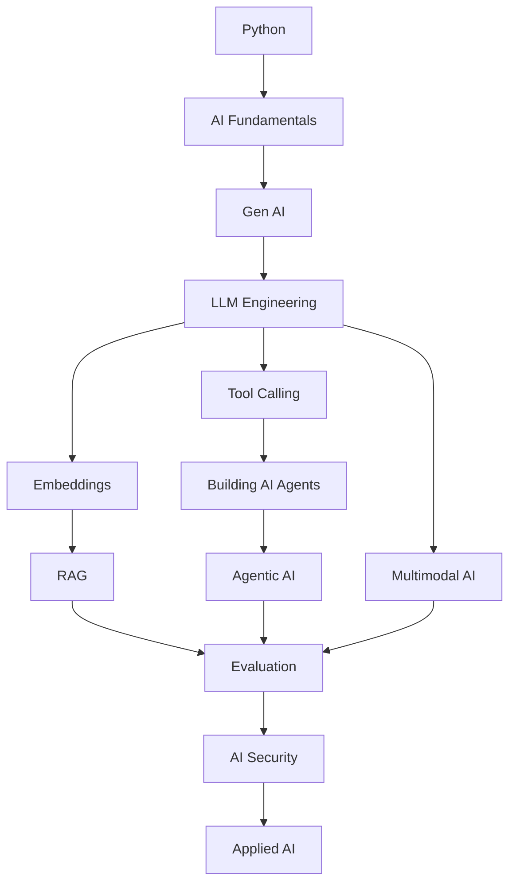

```mermaid
flowchart TD
    A["Python"] --> B["AI Fundamentals"]
    B --> C["Gen AI"]
    C --> D["LLM Engineering"]

    D --> E["Embeddings"]
    E --> F["RAG"]

    D --> G["Tool Calling"]
    G --> H["Building AI Agents"]
    H --> I["Agentic AI"]

    D --> J["Multimodal AI"]

    F --> K["Evaluation"]
    I --> K
    J --> K

    K --> L["AI Security"]
    L --> M["Applied AI"]
```